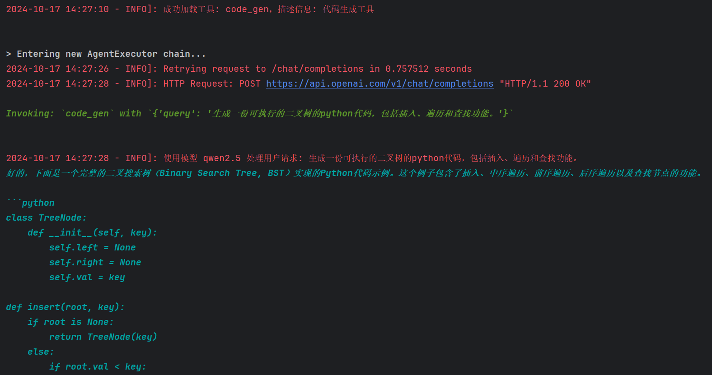
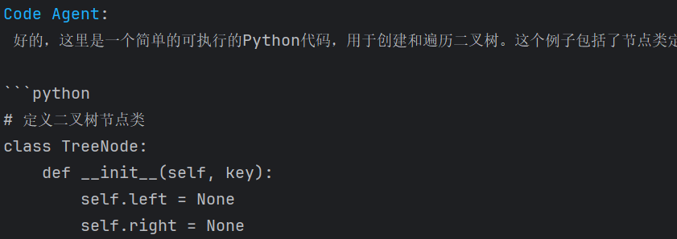

# AgentChatBot 项目


## 目录

- [项目简介](#项目简介)
- [功能](#功能)
- [新增内容](#新增内容)
- [安装与配置](#安装与配置)
- [使用说明](#使用说明)
- [许可证](#许可证)
- [工具代码模板](#工具代码模板)
- [如何添加工具到智能体](#如何添加工具到智能体)
- [预计更新内容](#预计更新内容)
- [模型选择/下载](#模型选择/下载)
- [VChat框架](#VChat框架)

## 项目简介

本项目<AgentChatBot>是基于langchain/Ollama实现agent的智能体机器人，通过vchat部署到私人微信中。可以自行设计与实现各种工具，供agent调用

## 功能

- **代码生成**: 使用本地部署的ollama客户端运行code类的模型进行代码的生成
- ......

### 新增内容
2024-10-22 新增搜索工具代码
2024-10-16 playground/swarm_agent 基于swarm框架，使用ollam客户端实现agent处理 (demo:水果店智能客服)

2024-10-16 新增使用swarm agent结构部署到server/bot中(swarm_agent_bot) 可自行选择使用ollama还是gpt
```bash
    使用ollama客户端  设置config/config.py中的OLLAMA_DATA{'use': True} chat/agent都是使用的ollama
    使用chatGPT客户端，设置config/config.py中的CHATGPT_DATA{'use': True} chat/agent都是使用的GPT
```

## 安装与配置

### 依赖安装

1. **Redis 安装**：[安装流程，点击跳转](https://blog.csdn.net/weixin_43883917/article/details/114632709)  
2. **MySQL 安装**：[安装流程，点击跳转](https://blog.csdn.net/weixin_41330897/article/details/142899070)
3. **Ollama 安装**：[安装流程，点击跳转](https://blog.csdn.net/qq_40999403/article/details/139320266)
4. **Anaconda 安装**：[安装流程，点击跳转](https://blog.csdn.net/weixin_45525272/article/details/129265214)

5. 克隆仓库：
    ```bash
    git clone https://github.com/panxingfeng/agent_chat_wechat.git
    cd <项目目录>
    ```

6. 创建并激活虚拟环境：
    ```bash
    conda create --name agent_wechat python=3.10
    conda activate agent_wechat # 在 Windows 上使用 conda activate agent_wechat
    ```

7. 安装依赖(使用清华源)：
    ```bash
    pip install -r requirements.txt -i https://pypi.tuna.tsinghua.edu.cn/simple/
    pip install aiohttp pytz vchat langchain_openai transformers -i https://pypi.tuna.tsinghua.edu.cn/simple/
    pip install mysql-connector-python langchain pillow aiofiles -i https://pypi.tuna.tsinghua.edu.cn/simple/
    pip install git+https://github.com/openai/swarm.git 或者 pip install git+ssh://git@github.com/openai/swarm.git
    ```

8. 运行：
    ```bash
    python main.py
    ```
9. 说明：开启agent智能体机器人，需要在聊天框中输入  #智能体  即可。
### 配置文件

项目的配置文件 `config/config.py` 包含了应用所需的配置信息。请根据实际情况修改该文件中的配置项，付费模型填入正确的key和use设置成True即可
```bash
    #########################################  离线/本地的大模型信息  #########################################
    
    CHATGPT_DATA = {
        'use': False,
        'model': 'gpt-4o-mini',  # 模型名称，GPT 模型的具体版本
        'key': '',
        # 你的 OpenAI API 密钥
        'url': 'https://api.openai.com/v1',  # OpenAI API 的地址
        'temperature': 0.7,  # 生成内容的多样性程度，0-1 范围内
    }
    
    OLLAMA_DATA = {
        'use': True,  
        'model': 'qwen2.5',  # ollama运行的模型名称
        'key': 'EMPTY',
        'api_url': 'http://localhost:11434/v1/'
    }
    
    MOONSHOT_DATA = {
        'use': False,
        'key': "",
        'url': "https://api.moonshot.cn/v1",
        'model': "moonshot-v1-8k",
        "prompt": ""
    }
    
    BAICHUAN_DATA = {
        'use': False,
        'key': "",
        'url': "https://api.baichuan-ai.com/v1/",
        'model': "Baichuan2-Turbo"
        # 百川模型不支持自定义提示词内容#
    }
    
         ............
```

### 使用说明
运行 python main.py，然后按照提示进行操作。

### 许可证
本项目使用 MIT 许可证 开源。

### 工具代码模板
在gpt_agent智能体中添加工具时，您可以使用以下代码模板：
```bash
class CodeGenAPIWrapper(BaseModel):
    base_url: ClassVar[str] = "http://localhost:11434/api/chat"
    content_role: ClassVar[str] = CODE_BOT_PROMPT_DATA.get("description")
    model: ClassVar[str] = OLLAMA_DATA.get("code_model") #可以使用其他的本地模型，自行修改

    def run(self, query: str, model_name: str) -> str:
        logging.info(f"使用模型 {model_name} 处理用户请求: {query}")
        data = {
            "model": model_name,
            "messages": [{"role": "user", "content": self.content_role + query}],
            "stream": False,
        }
        response = requests.post(self.base_url, json=data)
        response.raise_for_status()

        try:
            result = response.json()
            return result.get("message", {}).get("content", "无法生成代码，请检查输入。")
        except requests.exceptions.JSONDecodeError as e:
            return f"解析 JSON 时出错: {e}"

    def generate_code(self, query: str) -> str:
        try:
            result = self.run(query, self.model)
            if "无法生成代码" not in result:
                return result
        except Exception as e:
            logging.error(f"生成代码时出错: {e}")
        return "代码生成失败，请稍后再试。"

code_generator = CodeGenAPIWrapper()

@tool
def code_gen(query: str) -> str:
    """代码生成工具：根据用户描述生成相应的代码实现。"""
    return code_generator.generate_code(query)

# 返回工具信息
def register_tool():
    tool_func = code_gen  # 工具函数
    tool_func.__name__ = "code_gen"
    return {
        "name": "code_gen",
        "agent_tool": tool_func,
        "description": "代码生成工具"
    }

   ```
#### agent_tool演示示例


在swarm_agent智能体中添加工具是，您可以使用以下代码模板：
```bash
工具代码(code_gen为例)  保存到tools/swarm_tool/code_gen.py
def code_gen(query: str, code_type: str) -> str:
    """代码生成工具：根据用户描述生成相应的代码实现。"""
    client = OllamaClient()
    print("使用代码生成工具")
    prompt = CODE_BOT_PROMPT_DATA.get("description").format(code_type=code_type)
    messages = [
        {"role": "system", "content": prompt},
        {"role": "user", "content": query}
    ]

    response = client.invoke(messages, model=OLLAMA_DATA.get("code_model"))
    return response

在swarm_agent_bot.py中增加工具的智能体
    self.code_agent = Agent(
    name="Code Agent",
    instructions=CODE_BOT_PROMPT_DATA.get("description"),
    function=[code_gen],
    model=OLLAMA_DATA.get("model")
    )

在主智能体中增加一个跳转的方法：
self.agent = Agent(
    name="Bot Agent",
    instructions=self.instructions,
    functions=[self.transfer_to_code],  # 任务转发
    model=OLLAMA_DATA.get("model")
    )

#跳转code智能体
def transfer_to_code(self, query, code_type):
    print(f"使用的代码语言 {code_type} ,问题是 {query}")
    return self.code_agent

```
#### swarm工具代码演示示例



### 如何添加工具到智能体
1.根据示例工具代码进行编写工具代码

2.在tools/agent_tool目录下，增加一个工具的文件夹（例如：code_gen）

3.把工具代码保存为tool.py即可

4.swarm智能体的工具增加参考swarm示例代码


### 预计更新内容

1.基于RAG快速检索，完成自定义的客服助手(需要检索资料的文档放置serve/rag/file中即可)，提示词在config/templates/data/bot中修改(近期上传，还在编写中)

2.基于最新消息，持续更新工具内容(近期上传)

### 模型选择
支持模型：ChatGPT模型/ollama客户端的所有模型供agent使用

支持聊天的模型，增加了国内付费主流模型的客户端，可自行选择，通过修改模型数据中的“use”值改为True即可

#### 聊天模型测试示例图：


### VChat框架
VChat框架地址：https://github.com/z2z63/VChat
